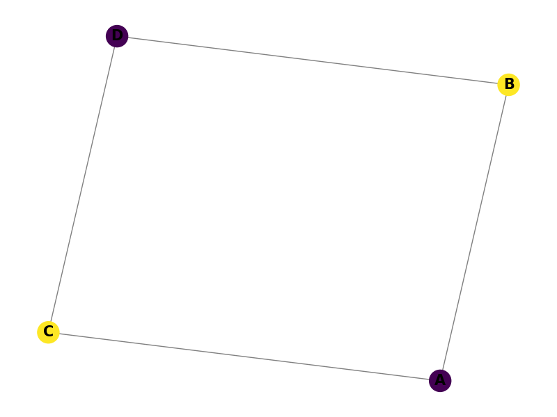
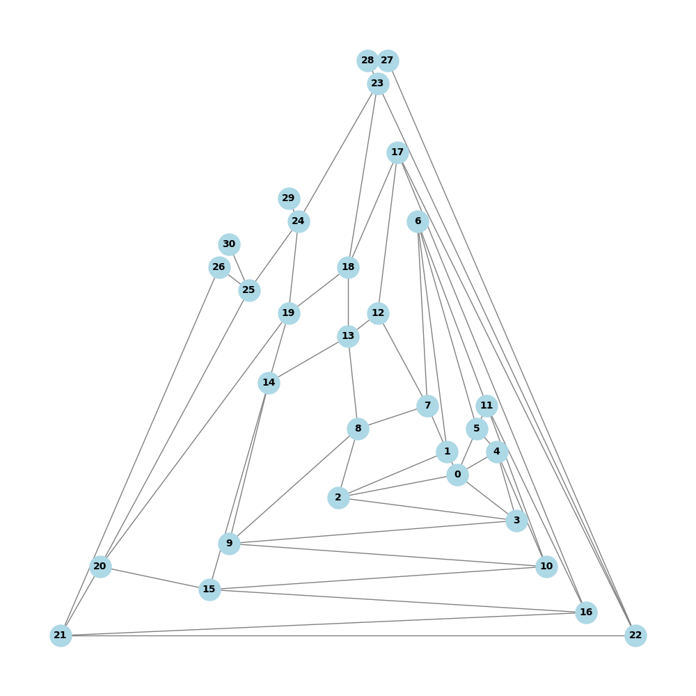

# Grafos
Este projeto tem como objetivo implementar e demonstrar algoritmos relacionados a grafos.
## Instalação

Siga os passos abaixo para configurar o projeto em sua máquina local:

1. Clone o repositório:

    ```` bash
    git clone https://github.com/Fariaslr/Grafos.git
    `````
2. Navegar até o projeto:
   ```bash
   cd Grafos
   ```
3. Instalar bilbliotecas:
   ```bash
   pip install pip install networkx matplotlib
   ```

## Grafos gerados

### Circuito Euleriano

O **Circuito Euleriano** é um ciclo que percorre todas as arestas de um grafo sem repetir nenhuma. Ele só existe em grafos onde todos os vértices têm grau par.


### Algoritmo de Prim

O **Algoritmo de Prim** é usado para encontrar a árvore geradora mínima (MST) de um grafo. Ele começa em um vértice e vai adicionando arestas de menor custo, formando uma árvore que conecta todos os vértices com o menor custo total.

 

### Algoritmo de Kruskal

O **Algoritmo de Kruskal** também encontra a árvore geradora mínima (MST), mas trabalha de forma diferente do Prim. Ele ordena todas as arestas por peso e as adiciona à árvore, sem formar ciclos, até que todos os vértices estejam conectados.


### Coloração de Grafos

A **Coloração de Grafos** é o problema de atribuir cores aos vértices de um grafo de modo que nenhum par de vértices adjacentes tenha a mesma cor. Esse problema é amplamente utilizado em diversas áreas, como escalonamento de tarefas e atribuição de recursos.



## Grafos Planares

O projeto também explora grafos planares e não planares, com alguns exemplos ilustrados abaixo. Um grafo é considerado **plano** se pode ser desenhado no plano sem que suas arestas se cruzem.

- **Tetraedro (Planar):**  
  O **Tetraedro** é um poliedro com 4 faces triangulares. É um exemplo de grafo planar, já que pode ser desenhado sem que suas arestas se cruzem.

   

- **Cubo (Planar):**  
  O **Cubo** é um poliedro com 6 faces quadradas. Também é um grafo planar, já que sua representação gráfica pode ser feita sem cruzamento de arestas.

  

- **Octaedro (Não planar):**  
  O **Octaedro** é um poliedro com 8 faces triangulares, e este grafo não é planar, ou seja, não pode ser desenhado sem cruzamento de arestas no plano.

   

- **Icosaedro (Planar):**  
  O **Icosaedro** é um poliedro com 20 faces triangulares. Ele é um exemplo clássico de grafo planar.

  

